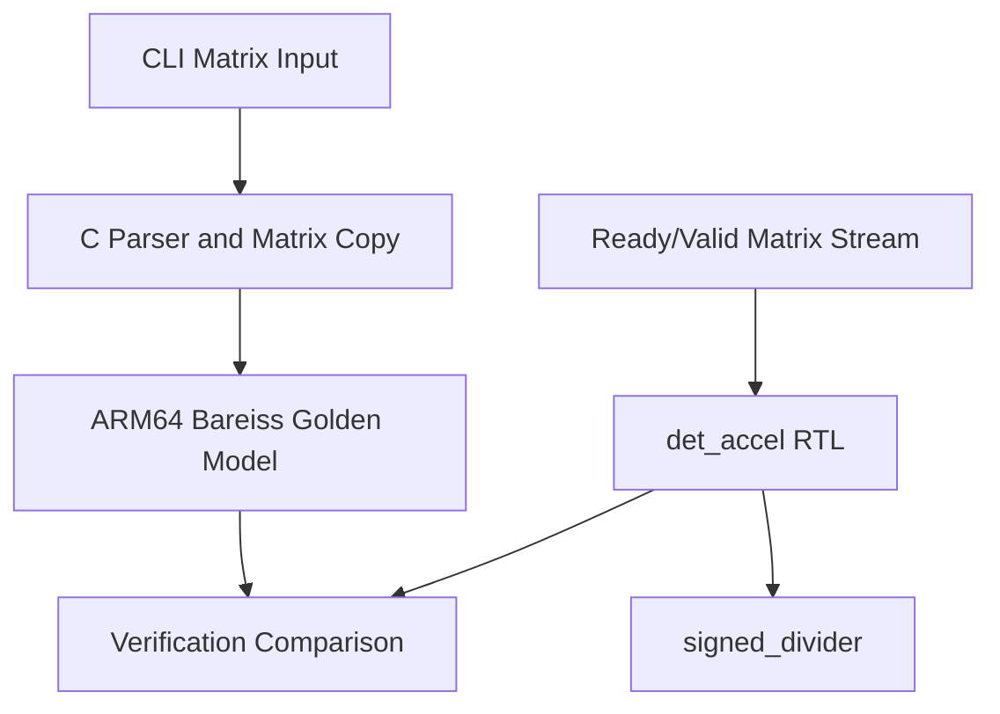

# Architecture

## System Overview

The project has two implementation paths:

- Software reference: C input parsing plus ARM64 assembly determinant calculation.
- Hardware accelerator: SystemVerilog RTL using fraction-free Gaussian elimination.



## Algorithm

The determinant algorithm is Bareiss elimination:

```text
a[i][j] = (a[i][j] * pivot - a[i][k] * a[k][j]) / previous_pivot
```

Bareiss is used because it behaves like Gaussian elimination while keeping exact integer results for integer matrices. This avoids rounding error and avoids introducing floating-point hardware.

## RTL Datapath

- Matrix storage: 16 signed 64-bit registers for a maximum `4x4` matrix.
- Input path: signed 16-bit values are sign-extended to 64 bits.
- Arithmetic path: two signed multiplications, one subtraction, and one iterative signed division.
- Divider: one shared 64-bit restoring divider to reduce area at the cost of latency.

## FSM Summary

| State | Purpose |
| --- | --- |
| `ST_IDLE` | Wait for `start` and validate `n` |
| `ST_LOAD` | Stream row-major matrix values into local storage |
| `ST_BASE` | Handle `1x1` and `2x2` fast paths |
| `ST_PIVOT` | Read the current pivot |
| `ST_FIND_SWAP` | Search for a nonzero pivot row |
| `ST_SWAP` | Swap rows and flip determinant sign |
| `ST_ROW_SETUP` | Select the next elimination row |
| `ST_COL_SETUP` | Select the next elimination column and form numerator |
| `ST_DIV_START` | Start signed division by previous pivot |
| `ST_DIV_WAIT` | Wait for divider result |
| `ST_ADVANCE` | Advance to next pivot or finalize |
| `ST_DONE` | Present result until `out_ready` |

## Design Tradeoff

The accelerator uses one shared divider instead of a fully parallel datapath. This keeps the design easier to explain and synthesize, but 3x3 and 4x4 matrices take hundreds of cycles. That is intentional for this version: the project demonstrates a complete design and verification flow before optimizing for throughput.
